# PetCare

<h2>💡 Motivação</h2>

Ao observar a falta de uma ferramenta que facilite os cuidados e acompanhamentos do animal de estimação, notou-se a viabilidade de criar um aplicativo destinado ao gerenciamento do animal que permitirá administrar um pet desde os cuidados como cartão de vacina, dados relevantes sobre a vacinação e anamnese.

O desenvolvimento desse projeto tem por foco a facilidade da versão eletrônica, envolvendo praticidade e segurança de ter todos os documentos e informações necessárias do pet, beneficiando tanto os usuários do aplicativo quanto profissionais da área, como veterinários.

<h2>💪 Dificuldades</h2>

Os desafios encontrados no projeto envolveram desde a etapa do desenvolvimento do aplicativo ao estruturar ideias e colocá-las em práticas sem muito conhecimento prévio. Além disso, o planejamento do layout, o que seria relevante ou não ao usuário, também foi uma dificuldade encontrada durante o percurso. 

Aprender uma nova linguagem de programação para o desenvolvimento do aplicativo, trouxe algumas dificuldades ao desenvolver o MVP além de diversos problemas que poderiam ou ainda podem surgir pela falta de experiência com a linguagem.  

<h2>💻 Tecnologias Utilizadas</h2>

A fim de elaborar a documentação do projeto, a digramação foi feita utilizando dois softwares, o Draw.io e o Lucidchart.

Com os diagramas desenhados, chegou a parte de prototipar o app. Foi utilizado o Figma para construção de design de interfaces. O Figma é uma ferramenta gratuita, permitindo criar um produto para as mais diversas plataformas, mantendo a acessibilidade do sistema.

Para a implementação do aplicativo foi escolhido o Flutter que é um <i>framework</i> (ferramenta) de desenvolvimento com foco multiplataforma em dispositivos móveis. Criado pela Google, é bastante utilizado no mercado e, mais recentemente, permite a criação de aplicações para desktop (Linux, Windows e macOS). O Flutter utiliza o Dart, também criada pela Google, uma linguagem otimizada para dispositivos clientes (ou <i>client-side</i>) multi plataforma.

  

Foram utilizadas duas IDE's, o Visual Studio Code e o Android Studio. O Visual Studio Code é um editor de código-fonte desenvolvido pela Microsoft para Windows, Linux e macOS. Ele inclui suporte para depuração, controle de versionamento Git incorporado, realce de sintaxe, complementação inteligente de código, snippets e refatoração de código. O Android Studio é o ambiente de desenvolvimento integrado (IDE) oficial para o desenvolvimento de apps Android. Com base no editor de código e nas ferramentas para desenvolvedores avançados do IntelliJ IDEA, o Android Studio oferece ainda mais recursos para aumentar sua produtividade ao criar apps Android.

  

  

  

  

  

  

  

<h2>✏ Prototipagem</h2>

A prototipagem foi criada no Figma como mencionado. E pode ser encontrada em [Prototipagem PetCare](https://www.figma.com/file/YonoXbSKjghswpb4J8TaaO/Pet-Care?type=design&node-id=0%3A1&mode=design&t=jSo65QcuTjvafGY1-1)

<h2>🎬 Vídeo demonstrativo</h2>

 

https://github.com/pablossousa/petcare/assets/92608962/3c997536-baa5-40c2-8b51-e30eac0fb455
 

<h2>⏳ Gostaríamos de Implementar</h2>

Algumas funcionalidades do sistema não puderam ser desenvolvidas devido ao curto prazo de implementação. Porém, podem ser possíveis adições ao sistema em futuras atualizações:

<ul>
  <li><b>Foto de perfl para o usuário e pet:</b> o usuário teria a opção de colocar uma foto de perfil para si e outras para seus pets podendo ser vistas em algumas telas como o menu principal, perfil do usuário e perfil do pet;</li>
  
  <li><b>Carteira de identidade para o pet:</b> cada pet teria uma carteira de identidade como no protótipo abaixo:</li>
  
   

  

      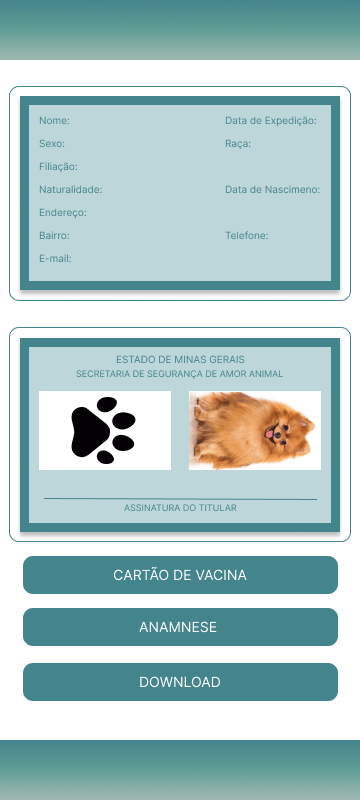
    

    
  <li><b>Download da identidade do pet e da carteira de vacinação:</b> nessas telas haveria a opção de baixar a identidade e a carteira de vacinação no celular para compartilhamento;</li>

 

      
  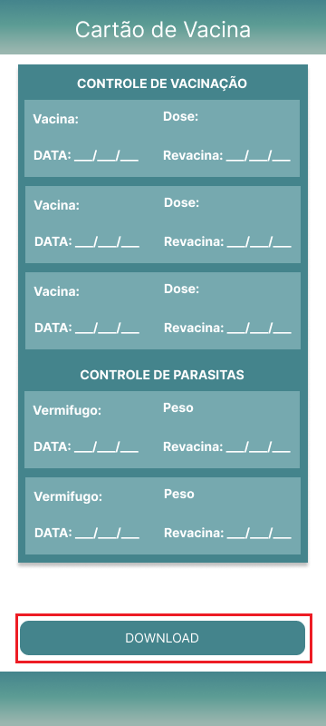
    

  
  <li><b>Seguir outros usuários:</b> seria possível seguir outros usuários para que possam ver os pets de amigos;</li>
  <li><b>Ver o perfil de outros usuáruios: </b> para ter conexão e networking, verificação de credibilidade, personalização e recomendações, aprendizado e inspiração, descoberta de conteúdo e interações sociais;</li>
  <li><b>Implantar um banco de dados não local: </b> para que o usuário não perca os dados se houver algum problema no app ou se ele apagar o aplicativo sem querer. Além disso, poderá seguir outros usuários que não estão cadastrados no app;</li>
  <li><b>Recuperação de senha por e-mail</b>: caso o usuário esqueça sua senha seria possível redefinir a senha via e-mail.</li>
</ul>

<h2>📢 Tutorial</h2>

Para conseguir executar o aplicativo, primeiramente precisará baixar o SDK do Flutter disponível em <a href="https://docs.flutter.dev/get-started/install">Install | Flutter</a>, descompactá-lo e colocá-lo em uma pasta no qual o caminho não deve conter caracteres especiais.

Em seguida será necessário uma IDE para a execução, neste tutorial será utilizado o Visual Studio Code como exemplo que está disponível para download em <a href="https://code.visualstudio.com/">VS Code | Download</a>. Com a IDE instalada, é necessário a instalação de uma extensão chamada "Flutter" dentro do VS Code na parte de "Extensions". Instalando essa extensão automaticamente a extensão do Dart será instalada. 

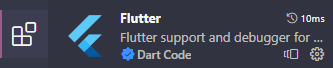

A próxima etapa é conseguir executar o aplicativo com um emulador no VS Code. Para isso, abre-se o projeto na pasta em que o download foi realizado e o mesmo perguntará automaticamente qual o SDK irá utilizar, então seleciona-se o que foi baixado do site oficial do Flutter. Caso não apareça automaticamente, basta teclar "F1" ou "Ctrl > Shift > P" no teclado para abrir a paleta de comando e buscar por "Change SDK".

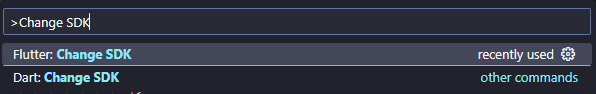

Também é provável que apareça uma notificação do VS Code pedindo para executar o comando "pub get". Clique nessa opção.

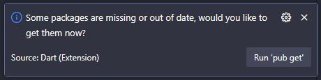

Por fim, para a última parte do tutorial precisa-se configurar um emulador do Android. Uma das formas mais fáceis de conseguir um emulador é instalando o Android Studio e baixar os emuladores nativos presentes nele. 

Para isso, baixa-se e instala-se o Android Studio disponível em <a href="https://developer.android.com/studio">Android Studio | Download</a> e cria-se um projeto qualquer para ter acesso a esse botão no canto superior direito (Device Manager):

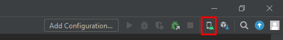

A opção "Create device" levará a uma tela para escolher o hardware, no caso escolha um celular na aba de "Phone". Como exemplo foi escolhido o Pixel 6. Em seguida seleciona-se a imagem do sistema e neste caso será o "R". Clica-se em "Next" e na próxima tela "Finish". 

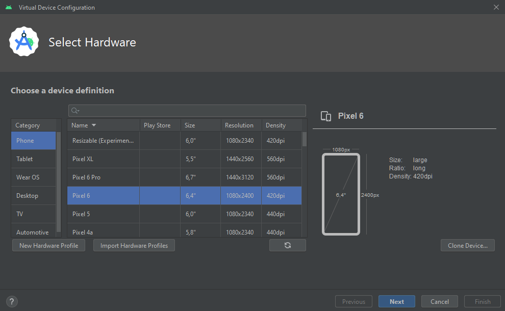

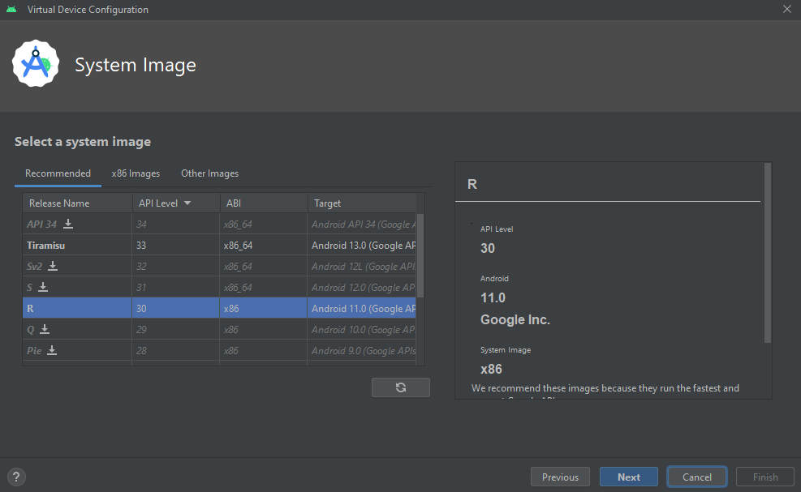

Ao fim da instalação deve ser possível acessar esse emulador no VS Code sem mais empecilhos. Reinicie o VS Code e vá na parte inferior direita da IDE e selecione o emulador instalado.

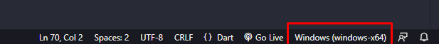

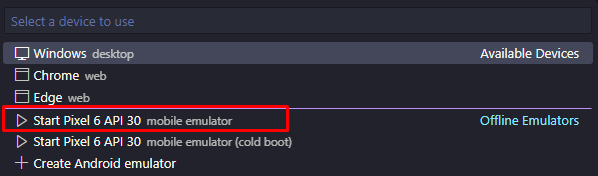

Ao clicar no emulador do Pixel 6 o sistema abrirá o celular. A primeira vez levará um tempo para carregar. Por fim, basta executar o arquivo "main.dart" e o aplicativo abrirá no celular.

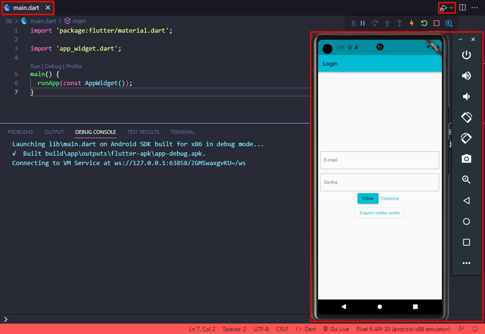

<h2>👨‍💻👩‍💻 Integrantes</h2>

**[Gabriel Teixeira Júlio](https://github.com/Kingdrasill)**

**[Lívia Gonçalves](https://github.com/Livia-Goncalves-01)**

**[Pablo Sousa da Silva](https://github.com/pablossousa)**
