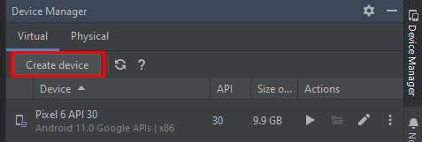

# PetCare

<h2>Motivação</h2>

<h2>Dificuldades</h2>

<h2>Tecnologias Utilizadas</h2>

A fim de elaborar a documentação do projeto, a digramação foi feita utilizando dois softwares, o Draw.io e o Lucidchart.

Com os diagramas desenhados, chegou a parte de prototipar o app. Foi utilizado o Figma para construção de design de interfaces. O Figma é uma ferramenta gratuita, permitindo criar um produto para as mais diversas plataformas, mantendo a acessibilidade do sistema.

Para a implementação do aplicativo foi escolhido o Flutter que é um <i>framework</i> (ferramenta) de desenvolvimento com foco multiplataforma em dispositivos móveis. Criado pela Google, é bastante utilizado no mercado e, mais recentemente, permite a criação de aplicações para desktop (Linux, Windows e macOS). O Flutter utiliza o Dart, também criada pela Google, uma linguagem otimizada para dispositivos clientes (ou <i>client-side</i>) multi plataforma.

  

Foram utilizadas duas IDE's, o Visual Studio Code e o Android Studio. O Visual Studio Code é um editor de código-fonte desenvolvido pela Microsoft para Windows, Linux e macOS. Ele inclui suporte para depuração, controle de versionamento Git incorporado, realce de sintaxe, complementação inteligente de código, snippets e refatoração de código. O Android Studio é o ambiente de desenvolvimento integrado (IDE) oficial para o desenvolvimento de apps Android. Com base no editor de código e nas ferramentas para desenvolvedores avançados do IntelliJ IDEA, o Android Studio oferece ainda mais recursos para aumentar sua produtividade ao criar apps Android.

  

  

  

  

  

  

  

<h2>Tutorial</h2>

Para conseguir executar o aplicativo, primeiramente precisará baixar o SDK do Flutter disponível em <a href="https://docs.flutter.dev/get-started/install">Install | Flutter</a>, descompactá-lo e colocá-lo em uma pasta no qual o caminho não deve conter caracteres especiais.

Em seguida será necessário uma IDE para a execução, neste tutorial será utilizado o Visual Studio Code como exemplo que está disponível para download em <a href="https://code.visualstudio.com/">VS Code | Download</a>. Com a IDE instalada, é necessário a instalação de uma extensão chamada "Flutter" dentro do VS Code na parte de "Extensions". Instalando essa extensão automaticamente a extensão do Dart será instalada. 

A próxima etapa é conseguir executar o aplicativo com um emulador no VS Code. Para isso, abre-se o projeto na pasta em que o download foi realizado e o mesmo perguntará automaticamente qual o SDK irá utilizar, então seleciona-se o que foi baixado do site oficial do Flutter. Caso não apareça automaticamente, basta teclar "F1" ou "Ctrl > Shift > P" no teclado para abrir a paleta de comando e buscar por "Change SDK".

Por fim, para a última parte do tutorial precisa-se configurar um emulador do Android. Uma das formas mais fáceis de conseguir um emulador é instalando o Android Studio e baixar os emuladores nativos presentes nele. 

Para isso, baixa-se e instala-se o Android Studio disponível em <a href="https://developer.android.com/studio">Android Studio | Download</a> e cria-se um projeto qualquer para ter acesso a esse botão no canto superior direito (Device Manager):

A opção "Create device" levará a uma tela para escolher o hardware, no caso escolha um celular na aba de "Phone". Como exemplo foi escolhido o Pixel 6. Em seguida seleciona-se a imagem do sistema e neste caso será o "R". Clica-se em "Next" e na próxima tela "Finish". 

Ao fim da instalação deve ser possível acessar esse emulador no VS Code sem mais empecilhos. Reinicie o VS Code e vá na parte inferior direita da IDE e selecione o emulador instalado.

Ao clicar no emulador do Pixel 6 o sistema abrirá o celular. A primeira vez levará um tempo para carregar. Por fim, basta executar o arquivo "main.dart" e o aplicativo abrirá no celular.

<h2>Integrantes</h2>
